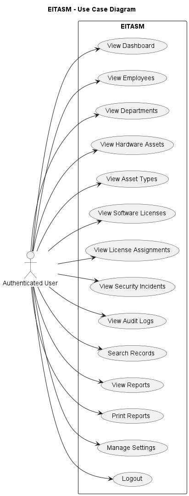
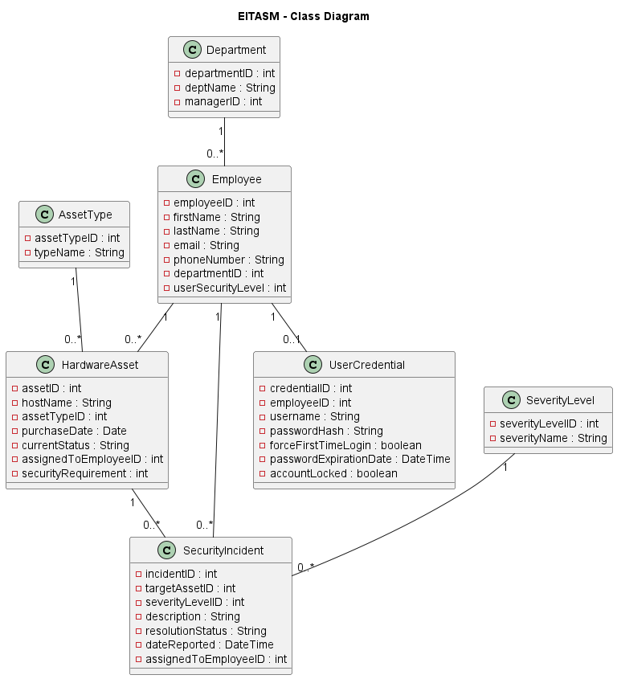

# EITASM – Requirements Specification

## 1. Functional Requirements
Functional Requirements — EITASM

FR-01 — User Registration
The system shall allow a new user to create an account by entering a first name, last name, email address, password, and password confirmation.

FR-02 — Registration Validation
The system shall validate registration data before creating an account. The email must be in a valid format, the password must satisfy the defined password rules, and the confirmation password must match the original password.

FR-03 — User Login
The system shall allow registered users and the default administrator account to sign in using an email address and password.

FR-04 — Login Validation
The system shall validate login credentials and display an error message when invalid credentials are entered.

FR-05 — Session Protection
The system shall restrict access to protected application pages when no authenticated user session exists.

FR-06 — User Logout
The system shall allow an authenticated user to log out and terminate the current session.

FR-07 — Dashboard Overview
The system shall display a dashboard containing summary information about employees, hardware assets, software licenses, departments, and security incidents.

FR-08 — Dashboard Data Loading
The dashboard shall retrieve and display application data from JSON data sources using JavaScript.

FR-09 — Employee Records
The system shall display employee information including employee ID, name, phone number, email address, department, and security level.

FR-10 — Employee Search
The system shall allow users to search and filter employee records.

FR-11 — Department Records
The system shall display department information including department ID, department name, manager, location, number of employees, and status.

FR-12 — Department Search
The system shall allow users to search department records by relevant department information.

FR-13 — Hardware Asset Records
The system shall display hardware asset information including asset ID, asset name, asset type, serial number, status, assigned user, and department.

FR-14 — Hardware Asset Search
The system shall allow users to search and filter hardware asset records.

FR-15 — Asset Type Management View
The system shall display hardware asset categories and calculate the number of assets belonging to each asset type.

FR-16 — Software License Records
The system shall display software license information including license ID, software name, vendor, license type, total seats, used seats, status, and expiry date.

FR-17 — Software License Search
The system shall allow users to search and filter software license records.

FR-18 — License Assignment Records
The system shall display software license assignments, including the assigned software, employee, assignment date, and assignment status.

FR-19 — License Assignment Search
The system shall allow users to search license assignment records.

FR-20 — Security Incident Records
The system shall display security incidents including incident ID, title, type, severity, status, reported user, and reported date.

FR-21 — Security Incident Search
The system shall allow users to search and filter security incident records.

FR-22 — Audit Logs
The system shall display audit log records containing the user, performed action, details, date, time, and event status.

FR-23 — Audit Log Search
The system shall allow users to search audit log records.

FR-24 — Reports
The system shall generate summary reports using employee, asset, license, and security incident data.

FR-25 — Charts and Metrics
The system shall display visual charts for asset distribution and security incident information.

FR-26 — Print Report
The system shall allow the user to print the Reports page using the browser printing functionality.

FR-27 — Settings
The system shall provide a settings page that allows users to modify application preferences such as organization name, time zone, date format, and notification preferences.

FR-28 — Save User Preferences
The system shall store selected application preferences locally and restore them when the user returns to the Settings page.

FR-29 — Navigation
The system shall provide navigation links between the main application modules, including Dashboard, Employees, Departments, Hardware Assets, Asset Types, Software Licenses, License Assignments, Security Incidents, Audit Logs, Reports, and Settings.

FR-30 — Search Requirement
The system shall provide search functionality within the major data management pages, satisfying the project requirement for search functionality.
## 2. Non-Functional Requirements

### NFR-01 — Usability
The system shall provide a clear, consistent, and user-friendly interface across all application pages.

### NFR-02 — Consistency
The system shall maintain consistent navigation, layout, typography, buttons, tables, and visual components throughout the application.

### NFR-03 — Performance
The system shall load local application pages and JSON data within a reasonable response time under normal usage conditions.

### NFR-04 — Security
The system shall restrict protected pages to authenticated users and redirect unauthenticated users to the login page.

### NFR-05 — Input Validation
The system shall validate user input where required to reduce invalid or incomplete data submissions.

### NFR-06 — Maintainability
The application shall use an organized folder structure separating pages, stylesheets, JavaScript files, data files, and documentation.

### NFR-07 — Reusability
Common functionality, such as authentication protection, shall be implemented in reusable JavaScript files where appropriate.

### NFR-08 — Compatibility
The web application shall function correctly in modern desktop web browsers.

### NFR-09 — Responsive Design
The user interface shall adapt to different screen sizes using responsive web design techniques and Bootstrap components.

### NFR-10 — Data Format
Application data stored locally shall use JSON format with a consistent and readable structure.

### NFR-11 — Reliability
The application shall handle missing or unavailable local data without causing the entire user interface to fail.

### NFR-12 — Accessibility
Forms, navigation elements, buttons, and data tables shall use meaningful labels and appropriate HTML elements to improve accessibility.

### NFR-13 — Code Organization
HTML, CSS, JavaScript, JSON data, and documentation shall be organized into appropriate project directories.

### NFR-14 — Version Control
The project source code shall be maintained using Git and GitHub to support version tracking and team collaboration.

### NFR-15 — Documentation
The project shall include sufficient documentation describing requirements, system design, diagrams, implementation, and testing.
## 3. Use Case Diagram

The EITASM system provides authenticated users with access to IT asset management, employee records, software licenses, security incidents, audit logs, reports, and application settings.

## 4. Class Diagram

The EITASM Class Diagram represents the main entities of the system and the relationships between them.

The diagram includes the following main classes:

- Department
- Employee
- AssetType
- HardwareAsset
- SecurityIncident
- SeverityLevel
- UserCredential

The relationships between these classes represent the structure of the EITASM system, including employee departments, hardware asset assignments, asset types, security incidents, severity levels, and user credentials.

